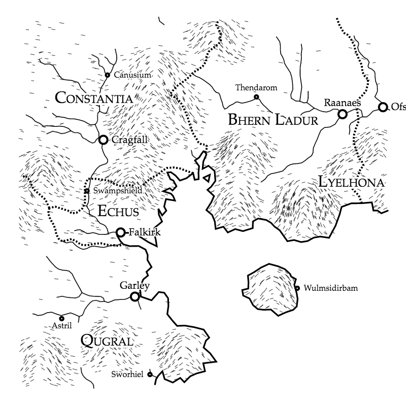

basic_mud
=========

# Basic Mud

In theory, this is a general purpose mud engine. However, we are making it
just to scratch our own itch. We have added significant though far from
complete set of features to the game. It is written in ruby, because that
is the language we most enjoy.

As part of this, you can see a bit of documentation about our world, too.

# Our World

No name yet.

Starting location is a city called Cragfall. Cragfall is a city-state that
is neutral and democratic. It is ruled by the people. Becoming a citizen
there is very difficult, though, and non-citizens are treated as second
class. Most players will probably want to venture out in order to seek
parties, friends, guilds, and other nations which may suit their character
more.

## Map

# Admin setup (production)

You'll need to find a way to psql into the postgres server. We run postgres
as a tied-off network in production (you can see that in the infra/ folder).
So, we actually need to run a container with access to it in order to give
ourselves admin access.

    ssh <server>
    cd $APP_HOME/basic_mud/infra
    docker-compose run mud /bin/bash
    $ apt-get install postgresql-client
    $ psql $DATABASE_URL
    $$ update classless_mud_players set level = 101 where id = 1;

# Dev setup

## Server

    bundle
    ./bin/classless_mud scaffold
    ./bin/classless_mud init
    ./bin/classless_mud start

## Server - Docker

    docker-compose build
    docker-compose up -d db
    docker-compose run mud ./bin/classless_mud init
    docker-compose up -d

## Client

    telnet localhost 2000
